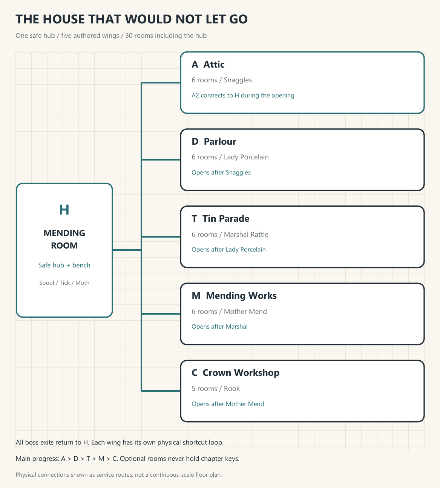
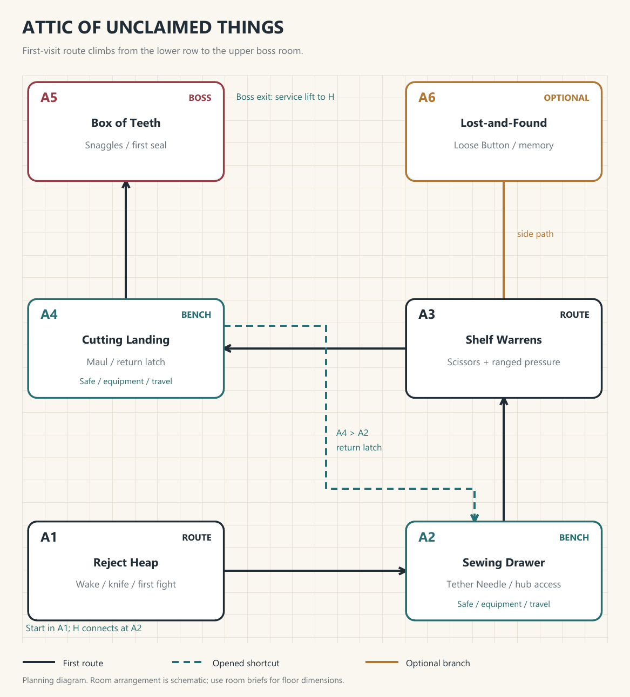
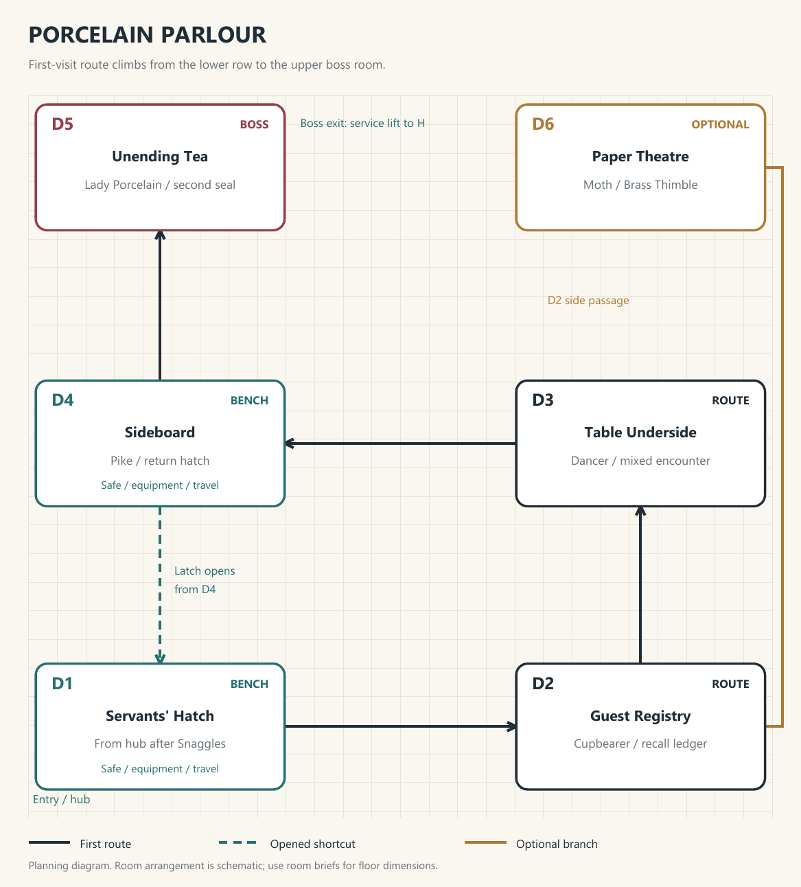
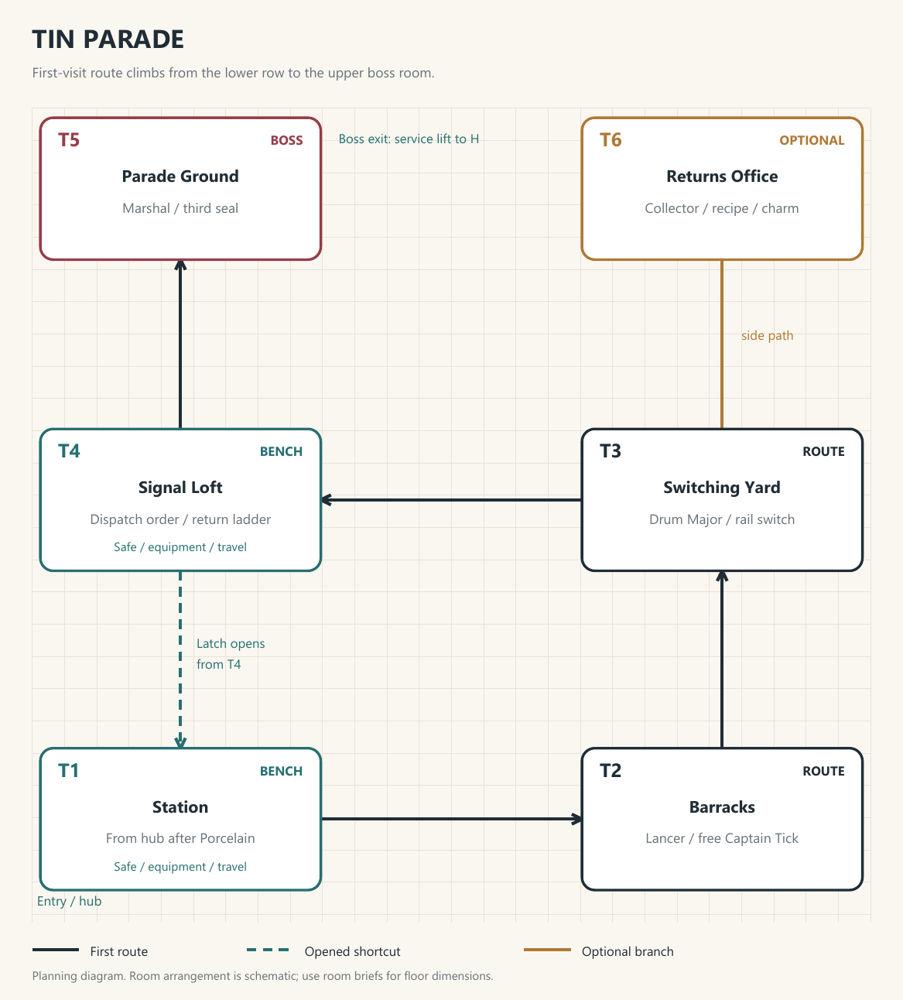
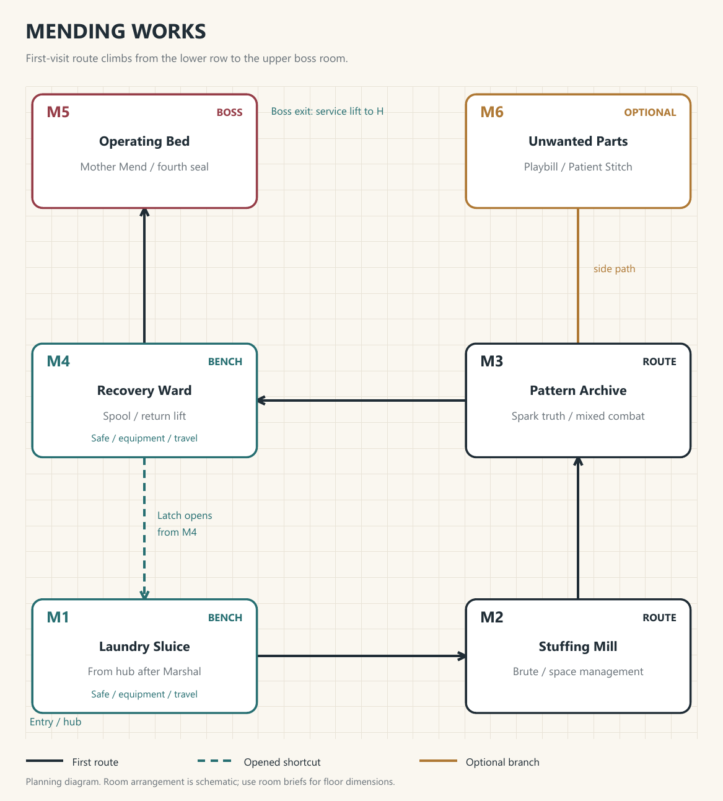
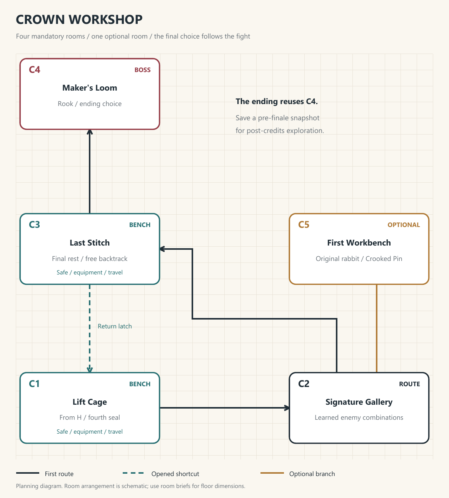
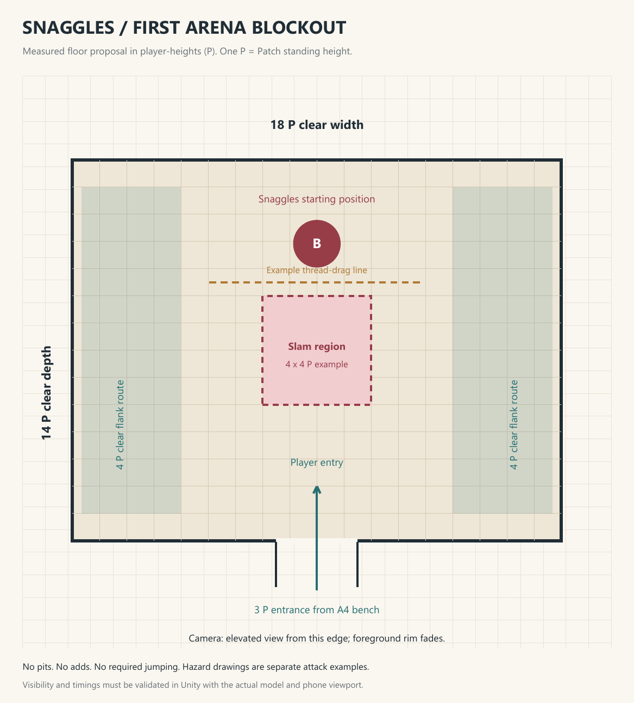

# STITCHED SOULS
## A Small Matter of Free Will

**Game design bible - proposal v1.0 | 25 September 2026**

*You were made to be thrown away. Try to disappoint them.*

A discarded patchwork toy wakes with a spark of freely given light inside its chest. Below the attic, a celebrated toymaker has promised that his creations will never be forgotten. Unfortunately, the demons handling that promise have an unusually strict interpretation of playtime.

Fight through an endless tea party, a parade with no finish line, and a hospital that considers individuality a manufacturing defect. Cut the stitches that bind the toys to their roles, gather a household of magnificent failures, and defeat the man who would rather own a living world than let it grow beyond him.

**The intended experience:** a demanding, funny, eerie mobile action adventure with an emotional ending. A normal first playthrough targets 4-8 hours; hard mode targets approximately 9-11 hours for a similarly experienced first-time player. These are design targets to validate, not measured playtimes or guarantees.

**The production shape:** one interconnected workshop; a safe hub; five compact chapters; five mandatory bosses and one optional boss; eight ordinary enemy archetypes; three weapon families; four equip-one skills; six collectible passive charms. Thirty authored rooms including the hub.

**Creative brief:** preserve the user's living toy, light spark, possessed enemies, and confrontation with their creator. Tone selected by the user: twisted adventure - eerie, playful, darkly funny. Small-team production, landscape orientation, offline single player, and a premium campaign are working recommendations, not confirmed business requirements.

**Status:** a complete creative proposal for review. This document does not report a playable redesign, tested performance, or completed production assets.

<!-- page -->

## 01 / The direction worth finishing

**Recommendation: a dollhouse dungeon.** Build an authored succession of compact wings around a repair-room hub. Seen from above, the workshop is a coherent place; experienced on foot, it is a chain of readable combat rooms, funny discoveries, and satisfying shortcuts. Old rooms gain meaning when a rescued character comments on them.

Three approaches were considered:

| Approach | What it buys | What it costs |
| --- | --- | --- |
| Interconnected workshop - recommended | Strong story, controlled encounters, meaningful shortcuts, reusable art | Requires deliberate room and camera design |
| Large free-roaming toy kingdom | Scale and discovery | Much more traversal, environment art, camera work, and testing |
| Repeating procedural toy dungeon | Replay variety with fewer authored spaces | Weaker story pacing; procedural encounters are a separate design problem |

The workshop offers the best chance of finishing the game without losing its personality. Scope is still substantial: six bosses and responsive action combat are the expensive parts, even with small maps.

**Five design rules**

- Every combat room teaches, tests, or remixes one readable idea.
- Toys attack according to the purpose that imprisoned them. Enemy behavior tells the story.
- Difficulty asks for judgment. Controls, camera, visibility, and interruptions must remain dependable.
- Rewards create decisions. Three distinct weapons matter more than thirty near-identical drops.
- Each chapter ends with a change in the household, not just a new key.

**The repeating loop:** leave a Stitch Bench, read the room, isolate a threat, punish a missed attack, expose its seam, Unpick it, collect materials, open a shortcut, then decide whether to risk the next encounter or return to safety.

**The moment-to-moment promise:** you are small and breakable, but you are never helpless. A huge pair of scissors is terrifying until you learn the sound it makes before closing.

**What the first release excludes:** open world, multiplayer, randomized loot, armor sets, crafting trees, procedural levels, manual platforming, multiple playable characters, live-service events, and branching dialogue trees. Build one excellent campaign.

<!-- page -->

## 02 / What is actually in the project

This review used the local project files and two local reference images. The live Unity connection returned a different project, WildEvolution, so no Stitched Souls playtest or scene-render verification was performed. Existing progress notes are historical claims, not newly verified results.

| Observed evidence | Useful foundation | Design decision |
| --- | --- | --- |
| Unity 6000.0.42f1 recorded in ProjectVersion.txt; URP listed in Packages/manifest.json | Existing Unity project | Keep the engine; assess installed package compatibility before development |
| Attic.unity, OutsideScene.unity, Test.unity, SampleScene.unity | Authored spaces already exist | Start with a small attic slice; the file list does not establish their completion |
| Patch model/prefabs and Patches-NewDesin.png | Stitched silhouette, large eyes, uneven fabric | Keep Patch as the working protagonist name and silhouette |
| Zombie, Gnashpatch, Snaggles, Patchwork Guardian assets | Candidate enemy and boss bodies | Evaluate rigs and animation fit before committing to reuse |
| Dollhouse, crates, wooden furniture, lights and terrain assets | Strong household scale language | Reuse as modular scenery where visual and technical quality permits |
| PlayerController, PlayerStamina, PlayerHealth, FlaskManager, Weapon scripts | Movement, attacking, rolling, stamina, healing scaffolding | Rebuild only what the approved combat design requires |
| CameraManager, RoomManager and three camera modes | Existing interest in authored cameras | Prototype one elevated arena camera first |
| AtticLevelCinematic.GiveLifeToPlayer | Light-driven awakening already fits the premise | Shorten and reshape into the proposed opening |

**Important integration facts:** the current Fixed2D camera follows X/Y and fixes Z; that is not the proposed elevated X/Z ground-plane camera. RoomManager currently returns after a room's first entry, so revisiting rooms needs explicit camera-state validation. PlayerController exposes a roll cooldown of 1.5 seconds; the proposal below uses stamina and recovery instead. These are inspection findings and future work, not fixes performed here.

The working tree already contains modified and untracked gameplay files. This deliverable adds design documentation and output artifacts only; it does not rewrite those files.

**Reuse condition:** assess silhouette at phone size, skeleton compatibility, animation quality, mesh/material cost, and actual asset-use rights. A matching filename alone does not prove an asset is ready for production.

<!-- page -->

## 03 / The story: the guarantee

Silas Rook once made peculiar toys by hand. His first success was not a perfect toy; it was a lopsided rabbit that a child loved enough to repair. But children grew up, fashions changed, and Rook began to mistake being needed for being loved.

In the lining of an antique sewing case he found a spool of black thread. The thing inside called itself **the Unraveller**. It offered a guarantee: *No toy of yours will ever be abandoned again.* Rook accepted. His workshop became a place where dolls served, soldiers marched, and stuffed animals smiled without ever being asked.

The guarantee had a mechanism. Each toy received a **Purpose Stitch**, binding a lesser demon to its original role. The demon did not invent the toy's cruelty; it repeated the assigned behavior without empathy, rest, or permission. The hostess would host forever. The guardian would protect by confinement. The repairer would remove every difference.

Rook fed the machine with **afterglow**: traces of affection clinging to returned toys. Under force, that light curdled into the black thread running through the house. He called the failures defective and sent them upstairs. The attic filled with bodies that twitched when the loom pulled on them.

The protagonist is one of those rejects: **Patch**, assembled from mismatched remnants, with an unfinished seam over the heart. A tiny light escapes a torn lining and enters that opening. It carries an old, freely given wish: *I wish you could choose what we play.*

Patch is not a reincarnated child or Rook's secret heir. The light is affection without ownership. Patch's ability to choose is the unexpected consequence.

Tonight Rook prepares the **Forever Collection**, a shipment linked to the loom. Once its final seal closes, his private nightmare can leave the house. The clock advances at story milestones; players never race a real-time deadline.

Patch initially wants an exit. Then they discover that leaving with the only free spark would leave everyone else stitched in place. Their goal becomes specific: break the four departmental Purpose Seals, enter Rook's Crown Workshop, defeat him, and decide what a living toy is allowed to be.

<!-- page -->

## 04 / The campaign, act by act

**Act I - Returned to sender.** Patch wakes under a rejection stamp. A voice in the walls announces, "If you can hear this, you have not been properly decommissioned." Learning to fight reveals black stitches inside familiar toys. Aunt Spool, hidden in a sewing drawer, identifies Patch's light and points toward Snaggles, the attic's keeper. Snaggles believes that anything outside its box will be hurt. Defeating him breaks the first seal. His last order collapses into a question: "May I put it down?" He sets down his scissors.

**Act II - Everyone is having fun.** The Porcelain Parlour holds a tea party where every empty chair is treated as an emergency. Lady Porcelain insists that Patch sit down and stay. Her guest book reveals that Rook recalled toys whose owners had merely grown older. In the Tin Parade, Marshal Rattle rehearses a triumphant return to children who no longer live at those addresses. An order signed by Rook confirms the shipment. The villain is making choices; he is not an innocent puppet of a demon.

**Act III - Repairs while you wait.** Mother Mend removes memory as readily as torn cloth. Her records show that the black thread failed to control toys that willingly changed their purpose. Aunt Spool admits she helped repair the first victims, believing she was helping them. Patch finds the lining carrying the original wish and learns that the spark came from many years of play, not a soul to be returned to a dead child. Mother Mend offers to close Patch's heart seam and make the frightening freedom stop. Patch refuses through action.

**Act IV - Meet your maker.** With four seals cut, the household helps Patch reach the Crown Workshop. Rook has sewn himself into a wooden maker's body so that neither age nor sleep can interrupt production. He sees Patch as the missing component: freely given light could make his machine work forever. He offers a place at his side, then tries to take the spark.

The final battle reverses the whole game's grammar. Rook tries to pin Patch into predetermined lanes and poses; Patch exposes the seams joining him to the loom. When those connections break, the Unraveller can no longer enforce its bargain. It is trapped in its empty spool, still insisting the guarantee is valid.

Rook is defeated on both ending paths. His fear explains his actions; it does not excuse them.

<!-- page -->

## 05 / An opening and ending people remember

**Opening: approximately 75 seconds, then movement.** Darkness. A stamp lands: REJECTED. A loose spark slips between floorboards, searches the rubbish, and pauses at Patch's torn chest. Patch wakes, discovers their hand is attached, checks the other one, and gives a small relieved nod. Somewhere below, hundreds of clocks strike different hours.

The loudspeaker says, "Good morning, valued products. Unscheduled feelings must be reported to Quality Control."

A path under a crate teaches movement. A slumped toy wakes only after the player has a clear view. Patch finds a broken seam blade and survives the first deliberate swing. At the safe drawer, Aunt Spool says, "You've come apart." Patch looks at the open heart seam. "No, love. I meant from the rest of them."

**Midpoint image.** A conveyor carries smiling doll faces over a bin labeled PERSONALITY: REMOVE BEFORE PACKING. Captain Tick asks whether his interest in baking counts. Aunt Spool quietly turns the label face down. The comedy stops long enough for the implication to land.

**Final exchange.** Rook: "I made you. I know what you're for." Patch pulls the production tag from their wrist and drops it. Patch stays largely wordless throughout; gestures leave room for the player.

**Ending A - Open the door, recommended thematic ending.** Patch uses the free spark to sever the loom's ownership stitch. The afterglow held inside returns to the toys it came from, sustaining their lives without the machine. Patch's own light gutters; the friends they freed stitch the torn body together by hand. Dawn. Snaggles trims hedges with alarming concentration. Tick burns a biscuit. Lady Porcelain asks, "Tea?" and accepts "No." The last sign on the workshop reads: REPAIRS, IF WANTED.

**Ending B - Keep the lights on.** Patch takes control of the loom, keeps its binding network intact, and cancels the shipment. Everyone is safe inside a gentler house, but the door remains locked. The Unraveller congratulates its new proprietor. Patch looks at the key. Hold on that uncertainty, rather than presenting tyranny as an upgrade reward.

Both choices are plainly described, available without hidden collectibles, and reuse the final room and short tableau shots. Optional quests change the epilogue details, not access to the satisfying ending. After credits, offer a clearly labeled pre-finale save and a separate New Game choice.

<!-- page -->

## 06 / The household and its humor

**Aunt Spool - a repair doll who has learned to ask.** Runs the hub's bench, upgrades weapons, explains the free spark. Initially treats Patch as a fragile patient; gradually trusts their decisions. Her guilt is conveyed through three short conversations. "I can mend most things. Opinions usually get worse."

**Captain Tick - a toy soldier with a baking ambition.** Freed in T2 on the main route, then returns to the hub. An optional visit to T6 retrieves his recipe card. He supplies the sixth charm and appears with a biscuit in the ending if helped. No escort AI, timed rescue, or permanently missable quest state. "I have led seventeen successful retreats from the kitchen."

**Moth - a folded-paper theatre usher.** Found in D6, then appears at the hub. Wants an audience allowed to leave. Collect one playbill in M6 and return it for a cosmetic paper collar and a 30-second tabletop play. Moth uses a simple card-like body and limited poses rather than a new complex creature rig. "The performance is compulsory. Attendance is entirely optional. We are improving."

**Patch - expressive, not a constant comedian.** A stitched body with curious pauses, hurried self-checks, and stubborn kindness. The player chooses behavior, not dialogue trees. Animation carries character: straightening a crooked sign, politely returning a thrown cup after combat, hiding behind a weapon slightly too large for them.

**Rescued bosses:** each receives one short, bespoke post-fight pose and line. They stay in their cleared chamber; do not create five additional hub simulation systems. Fast travel permits revisits. Their unique seal has been destroyed, so they do not respawn as bosses.

**Tone rules:** joke about factory rules, status, etiquette, and literal toy functions. Do not turn every death into a punchline. Preserve quiet after a rescue. Distress should come from control and distorted play, not realistic child suffering. Violence is torn stuffing, cracked varnish, spilled ink, and snapped thread.

**Narrative budget:** opening, final confrontation, and ending are the three main sequences. Use short in-engine staging with subtitles and sound. Five boss introductions under 12 seconds, skippable on retries; twelve optional lore objects under 60 words each; three NPC arcs. Full voice acting is a later budget choice. Main objectives and revelations are delivered on the mandatory route.

<!-- page -->

## 07 / Combat built for a phone

Landscape play, a left movement stick, and four right-side actions: **Attack, Dodge, Skill, Mend**. Interaction replaces the Skill button only out of combat, within range of a clearly labeled object. Menus pause offline play. Remappable controller support is desirable, but touch is the design baseline.

**Camera:** elevated three-quarter view, free movement on the X/Z floor plane, bounded framing per room. Doors and cover remain visible. Hide foreground walls when they obstruct action. Use a single authored angle through a combat encounter; rotate only in a safe connector, preserving the current movement direction until the stick recenters. No mandatory right-thumb camera movement, jump button, or manual precision aiming.

**Attack:** tap for one deliberate light attack; repeat for a short two- or three-hit chain. Hold for 0.30 seconds to charge a heavy attack, then release. A released tap below that threshold executes the light attack, with immediate press feedback. Offer a separate heavy-button accessibility layout if press/release latency tests poorly; validate this first in the slice. Dodging can cancel the charge before the strike, but not the committed hit window.

**Dodge:** directional roll; neutral input backsteps. It costs stamina and has recovery, not a long cooldown. No universal parry is required. A well-timed dodge rewards better positioning, and an optional charm can add a small thread refund.

**Targeting:** assist the nearest visible enemy within a forward cone. Strong directional input can override the choice; tap a visible enemy to prioritize it, but no encounter requires this. Retarget at the start of an action, never halfway through a swing. Do not attack through walls or snap to offscreen targets.

**The signature mechanic - Unpick:** heavy attacks, skill interactions, and punish hits build Seam Strain. At full strain, the enemy staggers and exposes a bright, broken-ring seam marker. A fresh Attack press within range performs a short finisher, tears out the binding knot, and restores Thread. Buffered normal attacks never automatically spend the finisher opportunity. Regular enemies take heavy damage; bosses lose a small capped fraction of health and resume fighting.

Unpick needs no extra button, tiny weak-point tapping, repeated swiping, or time-critical QTE. It gives the toy premise a mechanical identity and makes aggression useful without allowing thoughtless attack spam.

<!-- page -->

## 08 / Starting combat values and fairness

All figures on this page are initial tuning hypotheses. Test them on actual touchscreens at both supported frame rates before treating them as requirements.

| System | Prototype starting point | Purpose |
| --- | --- | --- |
| Health | 100; normal enemy hits 18-28 | Several mistakes are survivable |
| Stamina | 100; light 15, heavy 30, dodge 25 | Reserve enough for escape |
| Recovery | 28 stamina/sec after 0.6 sec without spending | Encourage deliberate pauses |
| Movement | Walking free; no separate sprint resource | Avoid punishing ordinary navigation |
| Dodge | 0.50 sec total; invulnerable from 0.08 to 0.28 sec | Clear commitment and usable timing |
| Input buffer | 0.12 sec, one action maximum | Accept intention without queueing a combo |
| Mend | 3 charges; heals 45; 1.1 sec commitment | Healing requires a created opening |
| Thread | 100 cap; 50 at a bench; hits +4; Unpick +25 | Skill economy sustained through combat |
| Skill recharge | 1 sec minimum between casts, plus cost | Prevent accidental duplicate activations |
| Boss duration | 2.5-4 min successful attempt | Mobile-friendly concentration window |

**Mend upgrades:** guaranteed charge increases after D5 and M5, ending at five. Charges refill on rest and death. The heal occurs at 0.7 seconds and consumes its charge at the same moment; interruption before that consumes nothing. Prevent use at full health.

**Unpick tuning:** regular enemy exposure lasts 2 seconds; boss exposure 2.5 seconds. Finisher lasts approximately 0.65 seconds with temporary protection. Boss finisher damage starts at 8% maximum health, cannot itself refill boss strain, and triggers a 10-second strain lockout. Skills cannot chain-stagger bosses. Tune ordinary weapon damage around meaningful pressure between these openings.

**Encounter fairness:** normally 1-3 active threats; four only when two are slow support units. At most two melee enemies receive attack permission simultaneously, staggered so their main hit windows do not coincide. Offscreen enemies reposition before starting a new attack. Existing projectiles remain dangerous and carry an edge warning. Bosses fight alone except for explicitly staged, capped summons that replace another attack pattern.

**Threat readability:** silhouette, sound, and shape distinguish a thrust, sweep, and floor hazard. Do not rely on red versus green. Show impact timing through animation; floor markers supplement it. Lock lunge direction before impact. Hard mode preserves these tells and the player's input and dodge windows.

<!-- page -->

## 09 / Weapons, skills, and small builds

**Three weapons, three complete movesets.** Equip one at a bench. Weapon swapping during combat, independent offhands, and duplicate rarity tiers are outside the first release.

| Weapon | Acquire | Role and limitation | Heavy attack |
| --- | --- | --- | --- |
| Seam Knife | A1, mandatory | Short range, quick recovery, steady single-target pressure | Committed thrust, strong strain against exposed targets |
| Bobbin Maul | A4, mandatory | Slow, broad hits; excellent stagger; punishes greedy swings | Overhead blow that cracks guard |
| Dressmaker's Pike | D4, mandatory | Safe reach and narrow arc; weaker close crowd handling | Step-in thrust that pins ordinary enemies briefly |

Reuse the existing hammer as the maul candidate. The knife and pike need an asset and animation review; a needle projectile does not substitute for a full melee moveset. Keep the existing gun as archived exploration, not a fourth launch weapon. No weapon is required to open a route or defeat a boss.

**Four skills; equip one.** The Skill button always casts the equipped action during combat. All become available on the mandatory path; none is a traversal lock.

| Skill | Unlock / Thread cost | Behavior and trade-off |
| --- | --- | --- |
| Tether Needle | A2 / 25 | Quick aimed-by-assist stitch; interrupts light enemies, modest boss strain, low health damage |
| Button Bastion | D5 / 35 | Absorbs one ordinary hit for 3 sec; cannot block grabs, floor hazards, or marked heavy crushes |
| Spool Decoy | T5 / 30 | Stationary dummy draws ordinary melee attention for 3 sec; bosses only redirect their next eligible targeted strike |
| Running Stitch | M5 / 35 | Short forward pierce through enemies; extra strain, no invulnerability; ends at walls and never crosses gaps |

**Six charms; equip two, no duplicates.** Loose Button (10% maximum health, A6); Brass Thimble (10% lower dodge cost, D6); Split Spool (Thread cap +25, T6); Patient Stitch (Mend restores +10 health, M6); Crooked Pin (+15% heavy-attack strain, C5); Good Company (first Unpick per encounter grants a small one-hit barrier, Tick's recipe quest).

Examples: **Unraveller** = knife, Tether Needle, Crooked Pin + Split Spool; **Doorstop** = maul, Bastion, Loose Button + Patient Stitch; **Troublemaker** = pike, Decoy, Brass Thimble + Good Company. These are equipment choices, not separate class systems.

<!-- page -->

## 10 / Progression, death, and interruption

**Two resources are enough.** Scrap is ordinary earned currency; Pattern Pieces are guaranteed chapter rewards. Spend Scrap to improve each weapon from +0 to +3. A chapter unlock increases the available upgrade tier for every weapon, so changing your mind does not require a rare-material grind. Target upgrades of roughly +12% damage/strain per tier; do not scale enemies automatically to the player.

Pattern unlocks: first seal opens +1; second opens +2; third opens +3. The fourth grants Running Stitch and the last Mend charge. Mandatory encounters and visible pickups should fund one main weapon at the current tier plus experimentation with a second. Establish actual prices from the slice's measured earnings. Bench training dummies let players try unlocked equipment for free.

**Death:** Patch's body collapses, and the free spark returns to the last Stitch Bench. Drop only unspent Scrap as a visible bundle. Keep equipment, quest items, seals, upgrades, opened doors, and discoveries. The next death replaces the old bundle. Rest or death restores health, Mend charges, and Thread to 50; ordinary enemies reset. Named bosses stay defeated.

If death occurs in a boss arena, place the bundle just outside the fog threshold. The dramatic challenge is fighting the boss, not recovering money through its opening move. A fall returns Patch to the last safe ledge for modest damage; there are no kill pits requiring thumbstick precision.

**Why enemies return:** defeated bodies remain linked to the workshop's black-thread network. While the loom runs, rest gives its machinery time to restitch ordinary soldiers. Boss seals are unique anchors that Patch permanently cuts. Ending A breaks the network entirely. The postgame exploration option explicitly loads the pre-finale state.

**Benches:** safe, instantly understandable, with equipment, upgrades, local map, and travel to previously activated benches. Resting is explicit and warns that ordinary enemies return. Boss retry paths remain under about 20 seconds with no mandatory combat.

**Phone interruption:** pause immediately when focus is lost. Store durable progress at room transitions, pickups, spending, shortcuts, and boss rewards with an atomic save and backup. On ordinary suspended-app resume, restore the paused state; after process termination, return to a safe room-entry snapshot with transactions preserved and the current encounter reset. Do not attempt full arbitrary mid-boss serialization for the first release. No currency penalty for a phone call.

**Accessibility:** movable/scalable controls, left-handed layout, readable subtitles, separate music/effects controls, optional haptics, reduced flashes/shake, and assist settings independent of the two difficulty presets.

<!-- page -->

## 11 / The enemy cast

Eight behavioral archetypes are the launch ceiling. Material variations communicate location but do not count as new enemies. Proposed sharing uses soft-body humanoid, rigid doll/soldier, and heavy guardian rig families; verify compatibility rather than assuming retargeting will work.

| Enemy | First room | Tell and attack | Player answer / reuse candidate |
| --- | --- | --- | --- |
| Rag Drifter | A1 | Draws one arm back, then a slow sweep | Step outside range and punish; Zombie body candidate |
| Gnashpatch | A3 | Scissors open with a double click before a straight rush | Dodge sideways after tracking stops; existing Gnashpatch candidate |
| Pin Spitter | A3 | Head tilts and cheek glows before one aimed pin | Approach between shots or interrupt; Zombie variant |
| Cupbearer | D2 | Raises a saucer guard; retaliates after blocked light hits | Heavy attack or flank; rigid doll body |
| Ribbon Dancer | D3 | One audible wind-up, then two broad turns | Wait out both turns; low strain resistance; doll rig variant |
| Tin Lancer | T2 | Lowers lance and locks a straight lane | Side-step, punish long recovery; soldier variant |
| Drum Major | T3 | Beats a visible rhythm that speeds allies' recovery | Interrupt the drum first; harmless alone; soldier rig variant |
| Stuffing Brute | M2 | Squeezes its belly before a short stuffing burst, then grabs | Back out of the burst, punish grab recovery; Guardian candidate |

**Combination rules:** Drifter plus Spitter teaches approach under pressure; Cupbearer plus Dancer teaches separation; Lancer plus Drum Major teaches target priority; Brute plus Spitter tests range and space. Do not debut two new behaviors together. Quiet rooms follow the first difficult combination in each wing.

**Enemy states:** idle/patrol, notice, approach, wind-up, commit, recover, stagger, die, reset. Each attack declares facing-lock time, damage window, cancel rules, and recovery. The state machine, animation, and hit detection must agree. A visual stagger should never conceal a still-active attack hitbox.

**No universal zombie shuffle:** preserve the current creatures' unsettling bodies, but give their movement purpose. Drifters reach for an absent hug; Cupbearers nervously protect a place setting; soldiers march until their feet squeak. Reserve broken, jerky motion for transitions, keeping actual attack tells legible.

**Loot:** mostly Scrap, with fixed chapter pickups. No random healing dependency, rare-drop quest items, or farming requirements. Story-sized rewards live in authored places where players can discover them deliberately.

<!-- page -->

## 12 / Bosses I: storage and hospitality

### Snaggles, Keeper of the Unclaimed - A5

**Purpose distorted:** keep toys safe until collection. He has decided no collection can ever be safe. **Arena:** 18 x 14 player-heights, an open cutting table with padded edges; no fall deaths. Use the existing Snaggles body if its rig supports the required silhouette.

**Moves:** Double Snip - two lateral cuts announced by two clicks; Needle Drag - a visible floor line becomes a pulling thread; Box Slam - raises a storage lid before striking a rectangle. Each has a distinct sound and at least one punish window. The drag slows rather than yanking the camera.

**At 55% health:** opens his own storage pouch and gains a delayed third snip. The first demonstration occurs at range. Existing moves remain readable; no faster global animation playback. Landing heavy attacks after Box Slam builds the cleanest Unpick opening.

**Lesson:** do not punish the first hit of a combo. **Hard mode:** third snip may follow either combo after the pouch opens, with the same extra click; one clearly shown thread strip limits a flank. **Reward:** first seal, +1 upgrades, Parlour access. **Afterward:** "I kept every receipt. No one came." He releases a box of tags into the air.

### Lady Porcelain, the Unfinished Hostess - D5

**Purpose distorted:** make every guest feel welcome. Leaving is therefore an attack on her purpose. **Arena:** 18 x 16 player-heights; a tea-table edge at the back and two broad side lanes. Clear silhouettes survive cream-and-rose lighting.

**Moves:** Tea Service - three sequential saucer shots at the player's earlier positions; Curtsy - a bow followed by a wide skirt sweep; Reserved Seating - marks two fixed chair lanes, then slams chairs into them. Chairs are temporarily animated hazards, not physics clutter or full AI enemies.

**At 50% health:** her painted smile cracks; she combines a saucer volley with one marked chair lane. There is always a wide safe route. She exposes the fastening at her back after Curtsy; any weapon can build strain during that recovery.

**Lesson:** reposition with intention instead of rolling repeatedly. **Hard mode:** alternate chair-lane patterns and one delayed final saucer, announced by a separate cup chime. **Reward:** second seal, +2 upgrades, Bastion, fourth Mend charge. **Afterward:** "Would you like to stay?" She practices accepting the answer.

<!-- page -->

## 13 / Bosses II: duty and repair

### Marshal Rattle, Commander of the Last Parade - T5

**Purpose distorted:** always bring the troops home victorious. His parade keeps restarting before it can arrive. **Arena:** 22 x 16 player-heights, flat toy-train turntable; rails are floor markings, not mandatory moving platforms.

**Moves:** Bayonet Line - a long fixed-direction charge; Salute - a delayed overhead strike; Inspection - sweeps a rigid searchlight cone, then fires a single marked lane. Players see the cone and lane together; darkness never hides the boss.

**At 50% health:** calls two Lancers onto a perimeter lane. Rattle steps back and stops his regular attacks while they cross; the player can evade them without kills. They exit before normal combat resumes. This preserves one readable major event at a time.

**Lesson:** timing comes from the tell, not a constant rhythm. **Hard mode:** the second Lancer uses an offset lane; Salute has two clearly distinct raised-weapon poses with different delays. **Reward:** third seal, +3 upgrades, Decoy. **Afterward:** he issues his first useful order: "Dismissed." He does not know what to do with the silence.

### Mother Mend, Surgeon of Perfect Things - M5

**Purpose distorted:** repair all damage. She now calls opinions, memories, and asymmetry defects. **Arena:** 20 x 16 player-heights; sewing-bed platform, two broad lanes, three dormant clamps. Use a heavy guardian base with attached tools if feasible; avoid a new six-legged traversal rig.

**Moves:** Measuring Tape - horizontal sweep with a visible lifted elbow; Kindly Restraint - one clamp marks a floor region before closing; Corrective Stitch - three large needles strike sequential marked points. Her grab has a separate two-hand pose and can be dodged; escape is automatic after damage, with no button mashing.

**At 50% health:** she opens her own belly seam to repair herself. The first attempt is slow and clearly introduced. Damage during the exposed seam interrupts a small capped heal; all weapons and the starter skill can do this. Missing it does not reset the fight.

**Lesson:** create a safe opening, then commit. **Hard mode:** one clamp stays closed through the next attack, but a full escape lane remains. Healing remains capped; no infinite endurance loop. **Reward:** fourth seal, Running Stitch, fifth Mend charge, Crown access. **Afterward:** "Does it hurt?" For the first time, she waits for an answer.

<!-- page -->

## 14 / The maker and the optional monster

### Silas Rook, the Last Craftsman - C4

**Presentation:** Rook has transferred himself into a large articulated wooden maker's body, approximately three Patch-heights tall, fastened to his chair and loom. His original portrait and empty human coat tell the story without another animated human character. One arena, one boss health bar, two phases.

**Arena:** 22 x 18 player-heights with three marked loom lanes and safe cross routes. No instant-death edges. Stage Rook's upper body against the far wall so hands, tools, and seam markers remain visible on a phone.

**Phase one, 100-50%:** Shears sweep a wide arc; a stamp strikes a displayed rectangle; thread tries to pin one lane. Damage the reachable maker body and tools during recovery. Strain exposes a wrist binding; Unpick visibly tears one of the three connections. If health reaches 50% before three bindings are cut, the remaining connections snap during the transition, avoiding an invisible mandatory-finisher lock.

**Phase two, 50-0%:** Rook tears free into the arena using the same rig. His attacks become personal: a grasp for Patch's heart, a two-swipe chase, and a loom pulse with a visible gap. The Unraveller speaks through the empty chair, but gets no separate health bar or new boss model. Rook's grasp is the clearest opportunity to circle and attack his back seam.

**Hard mode:** the loom changes which lane stays safe between attacks, always previewed before the next commitment. One extra delayed swipe is announced by a creaking wrist. No unavoidable overlap of grasp and full-arena hazard. **Reward:** ending choice after victory; no pre-fight choice skips the required confrontation.

### The Warranty Collector - T6, optional

An oversized armored inspector built from the Stuffing Brute/Guardian family, covered in paper tags. "Your continued existence may invalidate the warranty." Introduce its base heavy-swing behavior here; M2 later remixes the silhouette for an ordinary enemy.

Three attacks: a receipt-roll lash, a stamp slam, and a short shoulder rush. Its chest opens for inspection after a missed slam. At half health, it tears off armor and exchanges the rush for two shorter steps. No additional phase rig or minions. Arena: 16 x 14 player-heights.

**Reward:** Split Spool and Tick's recipe card. Declining the fight never blocks a weapon, skill, ending, or mandatory upgrade. **Hard mode:** a delayed second stamp with a separate raised-arm tell. This is the first boss to cut if production exceeds the budget.

<!-- page -->

## 15 / The world and its gates

The entire adventure takes place in Rook's workshop-house at toy scale. A drawer becomes a shelter; a dumbwaiter becomes a district connection; a dollhouse occupies a whole chapter. Large scenery implies a bigger world than the player must physically traverse.

**H - The Mending Room:** one safe hub reached from A2. Aunt Spool lives in a half-open sewing cabinet. The bench, equipment stand, quest shelf, and future NPC spots are visible in one view. Five labeled service passages connect to the chapter entrances as seals unlock them. These passages are loading/streaming connectors, not extra counted rooms.

| Chapter | Rooms | Mandatory route | Optional room | Unlock |
| --- | --- | --- | --- | --- |
| A - Attic of Unclaimed Things | A1-A6 | A1-A2-A3-A4-A5 | A6 off A3 | Start; A2 links H |
| D - Porcelain Parlour | D1-D6 | D1-D2-D3-D4-D5 | D6 off D2 | Snaggles defeated |
| T - Tin Parade | T1-T6 | T1-T2-T3-T4-T5 | T6 off T3 | Lady Porcelain defeated |
| M - Mending Works | M1-M6 | M1-M2-M3-M4-M5 | M6 off M3 | Marshal defeated |
| C - Crown Workshop | C1-C5 | C1-C2-C3-C4 | C5 off C2 | Mother Mend defeated |

**Room count:** 24 mandatory chapter rooms + 5 optional chapter rooms + 1 hub = 30. Each room may contain 2-3 encounter pockets separated by cover or a bend, never all active at once. Connectors and elevators do not add hidden content scope.

**Shortcuts:** A4 to A2; D4 to D1; T4 to T1; M4 to M1; C3 to C1. Each latch opens from the later room, then works both ways forever. The shortcut is a physical route, not a teleport disguised as a door. Boss exits return to H through a visible service lift.

**Benches:** H, A2, A4, D1, D4, T1, T4, M1, M4, C1, C3: eleven total. All are outside enemy aggro volumes. Bench-to-boss paths are adjacent, empty, and short. There are no skill-gated main routes, late-game keys in optional branches, or one-way drops that strand the player.

The atlas at the end shows connectivity and spatial blockout proposals. It is a planning map set, not extracted geometry from the existing scenes.

<!-- page -->

## 16 / Room briefs: attic and parlour

Room footprints are preliminary clear floor dimensions in player-heights (P), not real-world meters. One P is Patch's standing height; normalize the imported model only after checking physics and animation scale. Maps show the intended arrangement; adjust corridors after camera testing.

| ID / footprint | Encounter or discovery | Completion / reward |
| --- | --- | --- |
| A1 Reject Heap / 14 x 10 P | Awakening, movement, one Drifter; acquire Seam Knife before combat | Open crate passage to A2 |
| A2 Sewing Drawer / 12 x 10 P | First bench, Aunt Spool, safe practice dummy | Tether Needle; route to H and A3 |
| A3 Shelf Warrens / 24 x 14 P | First Gnashpatch alone, then Drifter + Spitter in a second pocket | Main path to A4; side ladder to A6 |
| A4 Cutting Landing / 16 x 12 P | Maul pickup and a guarded heavy-attack practice opportunity | Bench; open latch to A2; boss view |
| A5 Box of Teeth / 18 x 14 P | Snaggles boss, no additional enemies | First seal; service lift to H |
| A6 Lost-and-Found / 12 x 10 P | Optional Drifter pair around crates; short original-wish hint | Loose Button; return to A3 |
| D1 Servants' Hatch / 12 x 10 P | Bench, view into impossible tea party | Main route to D2 |
| D2 Guest Registry / 18 x 12 P | Cupbearer alone, then a separated Drifter pair | Recall ledger; optional door to D6 |
| D3 Table Underside / 24 x 16 P | First Dancer; later Cupbearer + Dancer around broad table legs | Open route to D4 |
| D4 Sideboard / 14 x 12 P | Quiet weapon discovery and glimpse of hostess | Pike, bench, latch to D1 |
| D5 Unending Tea / 18 x 16 P | Lady Porcelain boss | Second seal; H lift |
| D6 Paper Theatre / 14 x 10 P | Rescue Moth after one simple Spitter encounter | Brass Thimble; return to D2 |

**Attic identity:** steep roof beams overhead, broad wooden floor lanes, discarded labels, pale morning light that never quite reaches the floor. A3's verticality is scenic shelving with automatic ladder transitions; combat stays on flat surfaces. The first return through the A4 latch should produce a clear "I know this place" moment.

**Parlour identity:** faded cream, bruised rose, enormous porcelain feet, tablecloths like theatre curtains. Tea stains mark safe floor; animated hazards remain high contrast. The party's laughter comes from a skipping sound cylinder the player can stop in D4.

**Pacing rule:** put lore and equipment in safe pockets. No important reading while an unseen enemy can approach.

<!-- page -->

## 17 / Room briefs: parade, works, crown

| ID / footprint | Encounter or discovery | Completion / reward |
| --- | --- | --- |
| T1 Station / 14 x 10 P | Bench and parade announcement | Route to T2 |
| T2 Barracks / 18 x 14 P | Lancer alone, then Drifter pair; free Tick | Tick returns to H; route to T3 |
| T3 Switching Yard / 26 x 16 P | Drum Major introduction, then Lancer + Major | Manual rail switch opens T4; side branch T6 |
| T4 Signal Loft / 14 x 12 P | Quiet dispatch order; no precision climbing | Bench, latch to T1 |
| T5 Parade Ground / 22 x 16 P | Marshal Rattle boss | Third seal; H lift |
| T6 Returns Office / 16 x 14 P | Optional Warranty Collector | Split Spool, recipe card; return to T3 |
| M1 Laundry Sluice / 14 x 10 P | Bench; glimpse of repair belt | Route to M2 |
| M2 Stuffing Mill / 22 x 16 P | Brute introduction or familiar-body remix after T6 | Route to M3 |
| M3 Pattern Archive / 24 x 16 P | Spitter + Brute, separated by broad storage racks | Mandatory spark revelation; branch M6 |
| M4 Recovery Ward / 16 x 12 P | Aunt Spool's apology via speaking tube | Bench, latch to M1 |
| M5 Operating Bed / 20 x 16 P | Mother Mend boss | Fourth seal; H lift |
| M6 Unwanted Parts / 14 x 12 P | Optional Dancer + Drifter; no new enemy | Patient Stitch, Moth's playbill; return M3 |
| C1 Lift Cage / 14 x 10 P | Final chapter bench; household farewell | Route to C2 |
| C2 Signature Gallery / 26 x 16 P | Two separated mixes of learned enemies; Rook portraits | Branch C5; route to C3 |
| C3 Last Stitch / 14 x 12 P | Final bench and clear ending stakes | Latch to C1; freely revisit earlier wings |
| C4 Maker's Loom / 22 x 18 P | Rook, ending choice, reuse room for epilogue shots | Campaign completion |
| C5 First Workbench / 12 x 10 P | Quiet original rabbit and a voluntary practice duel against one Lancer | Crooked Pin; return C2 |

**Tin Parade:** midnight blue and brass, scale-model streets painted on workshop boards. Trains are a background spectacle and bounded lane hazards, never a fully simulated transport system.

**Mending Works:** warm surgical amber, muslin screens, numbered patterns, stuffing drifting like snow. The machinery looks busy while only nearby hazards simulate. No gore is necessary for the horror.

**Crown Workshop:** clean ivory and black signatures, almost no clutter. Rook's idea of perfection is emptiness. C5 reveals that his first beloved toy was crooked, so optional exploration enriches the final argument without carrying essential exposition.

<!-- page -->

## 18 / Reaching 4-8 hours honestly

Room count does not itself create playtime. Targets below include first-time exploration, ordinary fights, discoveries, boss attempts, and travel. Never stretch a chapter by increasing walking distance or requiring farming.

| Segment | Standard main-route target | Hard main-route target |
| --- | --- | --- |
| Attic | 50 min | 75 min |
| Parlour | 55 min | 90 min |
| Tin Parade | 60 min | 100 min |
| Mending Works | 65 min | 110 min |
| Crown Workshop and ending | 45 min | 85 min |
| Hub visits and inter-wing travel | 25 min | 35 min |
| Main-route total | 300 min / 5 h | 495 min / 8 h 15 |
| Optional rooms, quests, Collector | 45-75 min | 60-105 min |
| Typical exploration total | 5 h 45 - 6 h 15 | 9 h 15 - 10 h |

The wider standard target is 4-8 hours because player familiarity and retry counts vary. Hard's public-facing target should be "around 10 hours," not a promise that every expert requires ten. Experienced returning players will finish much faster.

**A sample 55-minute wing:** 22 minutes of first-pass rooms and ordinary encounters; 8 minutes of discoveries and safe dialogue; 6 minutes of successful boss fighting including entry/exit; 14 minutes of failed attempts and fast resets; 5 minutes of navigation and bench decisions. If testers need only 20 minutes for the wing, add a worthwhile encounter/discovery pocket or revise the length claim. Do not manufacture the missing time with idle travel.

**Difficulty presets:** Standard is the intended demanding campaign; Hard is available at New Game. Assist settings are separate. Both use identical story, checkpoints, saves, player response, and full rewards. Difficulty can change at benches, with only an optional completion badge tracking the original mode.

**Hard differences:** selected enemy combinations replace encounters rather than simply doubling crowds; bosses gain the specified telegraphed variations; ordinary damage starts at +15%, boss damage +20%, health no more than +10%, and strain resistance +15%. These are tuning seeds. Preserve dodge windows and basic tells. Optional branches become more demanding through positioning. Do not reduce healing charges, add corpse-run fights, or lock content behind the mode.

**Validate:** log active play separately from pause time, per-room first visits, deaths by attack, boss attempts, damage taken, healing used, optional completion, and device/frame mode. Compare first-time players of similar experience. Use 6-8 testers for the slice and a broader campaign test later; small samples guide changes rather than proving market-wide timing.

<!-- page -->

## 19 / Art, sound, and mobile constraints

**Visual language:** preserve Patch's large eyes, stitched silhouette, and uneven fabric from the local reference. Give free light a warm cream center with a cyan edge; hostile bindings are ink-black with sharp magenta accents. Separation must still work without color. Avoid covering every surface in dark noise: a small screen needs clean floors and distinct bodies.

**Scale:** scenery carries the spectacle. One giant dressmaker's shears silhouette can frame a whole room. Broad thread ropes, buttons, label signs, and dollhouse doors recur across chapters. Keep realistic human architecture in the distance; toy-accessible paths have their own consistent scale.

**Audio:** wooden knocks for soldiers, ceramic clicks for dolls, cloth strain for rag enemies. Every lethal commitment gets a distinctive cue. Music boxes and small percussion build the score; drop the melody when a boss gains a new pattern so the tell can be heard. Key warnings are also visual and do not require headphones. Comedy comes from short announcements, not repeated combat barks.

**Initial rendering constraints, pending profiling:** one dominant shadow-casting light; baked environment lighting where practical; restrained particles; short-lived pooled hit effects; minimal overlapping transparent fog; a current room plus at most a small neighbor preload. Use three reusable environment kits: timber/shelves, painted dollhouse/porcelain, and workshop machinery. The finale remixes machinery with cleaner materials.

Target a stable 60 fps on the selected mid/high-tier phones and a deliberate 30 fps quality mode on the selected minimum devices. Simulation timing must be in seconds, not animation-frame assumptions. Test input, dodge, and heavy-attack behavior at both. No minimum-device performance claim is possible from file inspection.

Apple's game-design guidance treats movement, camera adaptation, control placement, and feedback as touch-design concerns. That supports testing the camera and control layout together rather than merely shrinking console controls. [Apple, Design advanced games for Apple platforms](https://developer.apple.com/videos/play/wwdc2024/10085/)

Android's guidance emphasizes profiling frame consistency; its Thermal API documentation describes responding to device heat, including workload/quality adjustments through Unity Adaptive Performance. This proposal therefore requires sustained device tests, not just an editor frame-rate reading. [Android, game performance](https://developer.android.com/games/optimize) and [Android, Thermal API](https://developer.android.com/games/optimize/adpf/thermal)

Record CPU/GPU frame times, memory peaks, loading pauses, and heat behavior during at least 20-30 minutes of representative play. Choose the actual device floor before producing all chapters; scene budgets follow those measurements.

<!-- page -->

## 20 / Build the slice before the house

**The first deliverable is a 20-30 minute attic slice**, not the whole campaign. It includes a shortened A1-A5, a simple A6, one corner of H, two ordinary archetypes (Drifter and Gnashpatch), one complete weapon (Seam Knife), Tether Needle, Mend, Unpick, a shortcut, persistent progression, and Snaggles. Substitute a Drifter encounter for the launch A3 Spitter and defer the maul pickup. Use existing compatible art or neutral blockout geometry before commissioning replacements.

| Stage | Work | Evidence needed to move on |
| --- | --- | --- |
| 0. Recovery and baseline | Open the correct project; back up current work; establish an Android device build; review rigs and package compatibility | Repeatable launch, input, save/load, and an inventory of reusable assets |
| 1. Combat room | One camera, movement, attack, dodge, stamina, damage, healing, enemy recovery | Touch players can explain what hit them; no action locks or camera-hidden threats |
| 2. Toy identity | Add strain, Unpick, Tether Needle, audio/visual tells | Players use the seam mechanic because it helps, not because a tutorial orders them |
| 3. Playable loop | Connect slice rooms, hub bench, death bundle, latch shortcut, save states | Death/retry and quit/resume work without lost unlocks or duplicate rewards |
| 4. Snaggles | Complete tells, punish windows, phase change, rescue, chapter gate | Fight remains readable on the smallest target screen and the slowest supported mode |
| 5. External slice test | 6-8 target players, sustained device tests | Clear findings on controls, difficulty, appeal, and measured content production rate |
| 6. Content production | Finish remaining weapons; build D, then T, then M, then C | Each wing passes a device, save, and playtime review before the next expands |
| 7. Finish | Hard patterns, accessibility, narrative polish, endings, store preparation | Complete fresh-install campaigns and upgrade/resume checks on the device matrix |

**Slice acceptance:** at least most testers can move, dodge, heal, and explain Unpick without live coaching; first attempts feel attributable to a specific mistake; Snaggles can be beaten with the starting weapon and skill; retries require no forced filler fight. Track exact counts and feedback rather than claiming a small sample proves universal usability.

**Time discipline:** provisionally timebox the slice to 6-10 full-time development weeks for one experienced developer using compatible assets. This is an uncertain planning allowance, not a project estimate. Stop at the review even if art is incomplete. A full campaign is likely a many-month effort; estimate it only after measuring this project's actual room, animation, and boss production costs.

<!-- page -->

## 21 / Systems, cost, and the cut line

**Small system boundaries:** player action state owns allowed transitions; hit detection reports hits once per swing; health owns damage/death; encounter logic owns activation and resets; progression owns unlocks; save data owns durable facts; rooms own camera and doors. UI reads those states instead of maintaining competing combat booleans. Migrate incrementally from existing scripts after design review.

Stable room, boss, pickup, and door IDs are needed before persistence. Save schema should include version, last safe checkpoint, chapter seals, opened latches, owned/upgraded equipment, charms, quest steps, Scrap, and a death-bundle location. One transaction commits boss defeat, reward, and gate together; reload cannot grant the reward twice or leave the next door locked.

**Content inventory:** 30 rooms, 11 benches, 5 physical shortcuts, 8 ordinary archetypes, 5 mandatory bosses, 1 optional boss, 3 friendly NPCs, 3 weapons, 4 active skills, 6 charms, 12 lore objects, 3 major story sequences, and 2 short endings. Five rescued bosses need only a pose and brief dialogue, not roaming AI. Estimated attack-animation work is roughly 24 ordinary-enemy actions and 22 boss patterns/variants, plus player and reaction animations; sharing must be proven on the rigs.

**Forecast after the slice:** remaining cost = reusable room shells x measured shell cost + encounter pockets x measured encounter cost + remaining boss animation/AI/test cost + writing/audio/UI/save/device work + integration contingency. Count polish and rework explicitly. A six-room count does not imply six equal-cost rooms; a boss room can dominate an entire wing's effort.

**If the scope is too large, cut in this order:** optional Collector (T6 becomes a standard encounter with the same quest rewards); weapon-specific decorative finishers; Moth's optional play sequence; elaborate inter-room cinematics; bespoke prop variants. The core cut preserves the story, all five mandatory bosses, the shortcut loops, and all main-route rewards.

**If it still cannot fit:** merge Tin Parade into the Parlour as a themed sub-area and make Marshal an elite encounter. Retain Tick and the dispatch-order revelation. Reforecast toward the lower end of the 4-8 hour brief; do not claim the original six-hour plan survives unchanged. Hard duration must be remeasured too.

**Commercial recommendation, unvalidated:** plan the campaign as a paid offline experience, potentially with the slice as a demo. Decide platform release order, pricing, asset licenses, and business model separately before launch work. They are not blockers to the creative direction, but should not be quietly assumed settled.

<!-- page -->

## 22 / Verification and the next decision

**What this design establishes:** a complete causal story; a protagonist with a reason to act; an accountable creator; enemies shaped by the premise; five authored chapter routes; a bounded equipment system; specific boss patterns; optional rewards; two endings; and a build order centered on a playable slice.

**What it does not establish yet:** enjoyable touch combat, final balance, actual campaign length, asset compatibility, device performance, production cost, or commercial viability. Those require the slice and playtests. The existing progress note's completion labels do not replace this validation.

**Before full production, settle:** target minimum phones, solo/team capacity and weekly time, portrait versus landscape acceptance (this design recommends landscape), monetization, and the animation source. Do not wait for these to read and improve the story; resolve them before committing to the full content budget.

**Design checks for every wing:**

- Every mandatory gate opens through a mandatory event, with no optional item dependency.
- Every boss has a safe checkpoint and short retry; a failed attempt cannot consume a permanent progression resource.
- Each new attack is seen clearly before being mixed with another threat.
- Every weapon can finish every mandatory fight; no skill grants required traversal.
- The player's thumb and foreground scenery cannot cover essential attack tells.
- All unique rewards are saved once; forced termination after a reward preserves a coherent world.
- Humor never obscures an objective, a tell, or the consequence of an ending choice.

**Local evidence used:** PROGRESS.md; ProjectSettings/ProjectVersion.txt; ProjectSettings/ProjectSettings.asset; Packages/manifest.json; Assets/Scenes/Attic.unity; Assets/Resources/Scripts/PlayerController.cs, PlayerHealth.cs, PlayerStamina.cs, AtticLevelCinematic.cs; Assets/Resources/Scripts/Camera/RoomManager.cs and CameraMode_Fixed2D.cs; GnashpatchAI.cs; SnagglesBoss.cs; model/prefab inventory; Patches-NewDesin.png and Zombie_Toy_Red_Eyes.png. The latter is a texture atlas, not a rendered enemy screenshot.

**External references, consulted 25 September 2026:** Apple's WWDC24 presentation on advanced game design and the Android performance/Thermal API documentation linked on page 19 of the numbered design sections. These support the mobile testing approach; all narrative, room layouts, timings, budgets, and combat values are original proposals rather than claims derived from those sources.

**Recommended next decision:** review the premise, mobile camera, and Snaggles slice as one package. Once the direction is accepted, turn only that slice into a detailed implementation backlog. A small finished section will tell us more than expanding the design indefinitely.

<!-- page -->

## Atlas / World connections

The hub is a physical service junction; each chapter's exit returns through its lift. Solid routes are campaign progression; labeled gates open after the corresponding boss. Bench travel is available only to activated benches. This is proposed topology, not a map extracted from Unity.

<!-- page -->

## Atlas / A - Attic of Unclaimed Things

Main route A1-A2-A3-A4-A5; optional A6 off A3; hub entrance from A2. A4's latch opens the return loop to A2. Its bench makes the Snaggles retry short. Dashed connections open from the marked later room. Relative room placement is schematic; dimensions are in the room briefs.

<!-- page -->

## Atlas / D - Porcelain Parlour

Main route D1-D2-D3-D4-D5; optional D6 off D2. Reach D4 through the table underside, then open its return hatch to D1. The upper entrance to the boss keeps the table-edge spectacle away from the player's thumb area.

<!-- page -->

## Atlas / T - Tin Parade

Main route T1-T2-T3-T4-T5; optional Collector in T6 off T3. The yard switch opens the main gate to T4; it is an interaction after an encounter, not a timing puzzle. T4 opens a service ladder to T1. Train motion stays outside the main walkable route.

<!-- page -->

## Atlas / M - Mending Works

Main route M1-M2-M3-M4-M5; optional M6 off M3. The archive's story reveal is mandatory and safe after combat. The M4-M1 lift provides a recognizable return loop. Operating-room tools remain within the boss arena rather than spilling into camera transitions.

<!-- page -->

## Atlas / C - Crown Workshop

Main route C1-C2-C3-C4; optional C5 off C2. C3 opens its return latch to C1 before the finale. Entering C4 does not overwrite the pre-finale exploration snapshot; the ending choice happens only after defeating Rook.

<!-- page -->

## Atlas / Snaggles arena blockout

Initial measured blockout: 18 x 14 P clear arena, 3 P entrance, minimum 4 P clear side routes. Camera looks from the lower edge at an elevated angle; foreground rim fades if needed. The drawn attack regions are examples of individual attacks and do not imply simultaneous hazards. Solid edges prevent accidental fall deaths. Test the real imported Patch scale before converting P to Unity units.
